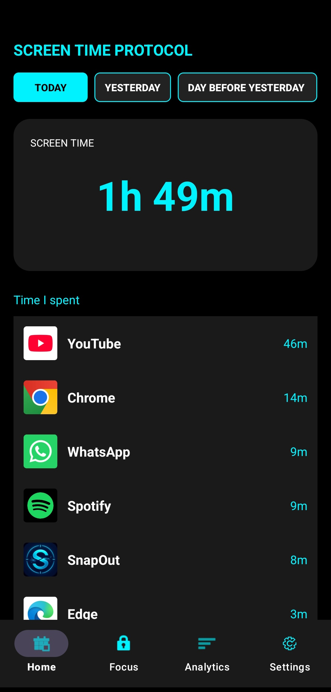
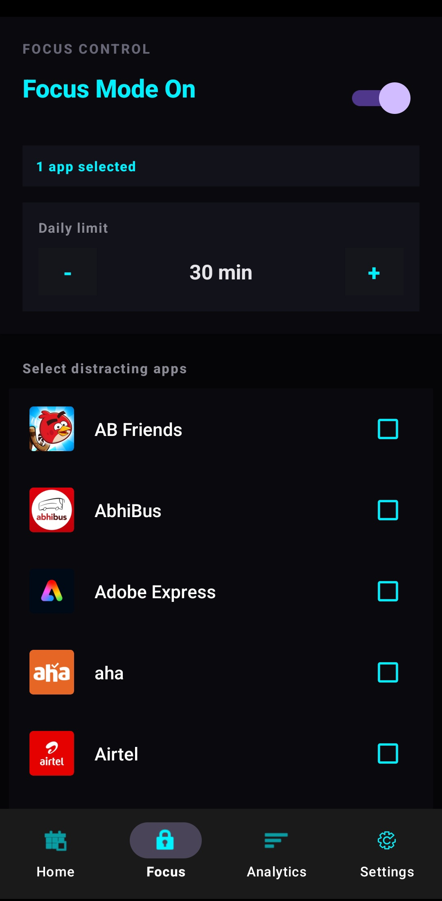
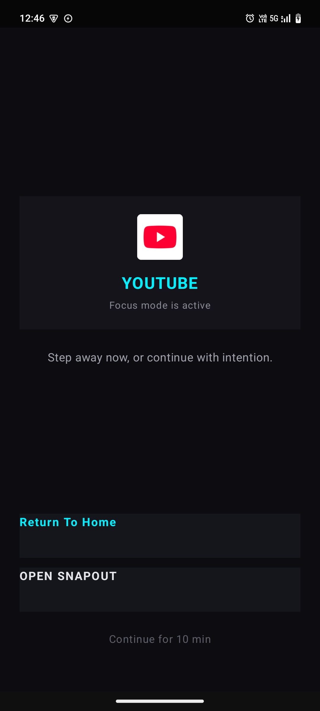
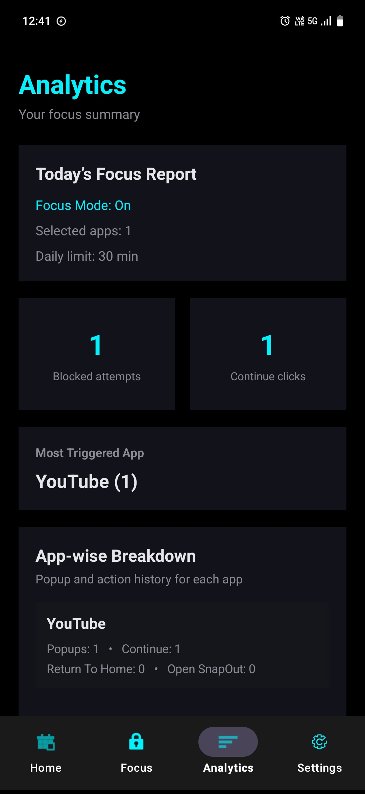
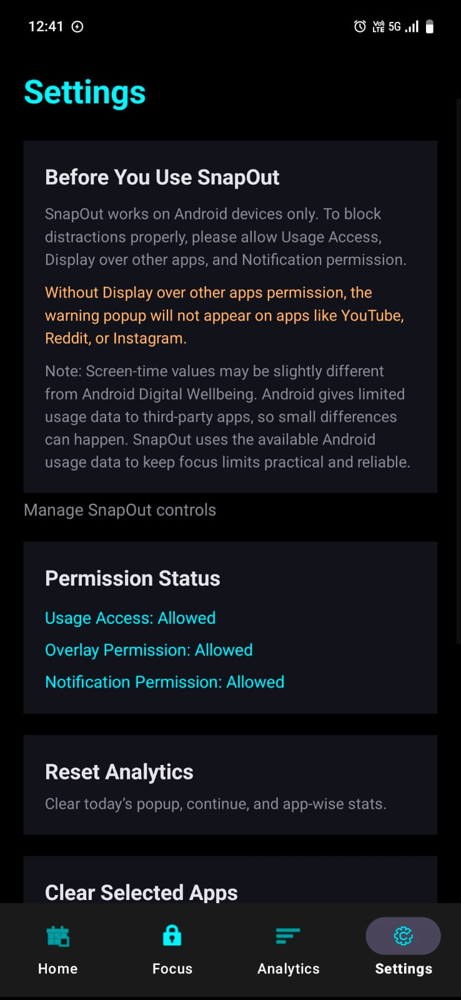

<h1>SnapOut</h1>

A native Android focus-mode app that helps users reduce doomscrolling, control distracting apps, and build better digital habits.

<h2>About the App</h2>

SnapOut is built for Android users who want to control distracting apps like YouTube, Reddit, Instagram, and other attention-draining platforms. The app lets users select distracting apps, set a daily usage limit, and shows an intervention popup when the limit is crossed.

<h2>Key Features</h2>

<ul>
  <li>Track screen time for Today, Yesterday, Day Before, and Week</li>
  <li>Select distracting apps for Focus Mode</li>
  <li>Set daily usage limit up to 5 hours</li>
  <li>Show intervention popup after the limit is crossed</li>
  <li>Lock In button to return to phone home screen</li>
  <li>Temporary Ignore option with a bypass timer</li>
  <li>Analytics dashboard with blocked attempts and app-wise breakdown</li>
  <li>Settings page with permission status and setup guide</li>
</ul>

<h2>Tech Stack</h2>

<ul>
  <li>Native Android</li>
  <li>Java</li>
  <li>XML Layouts</li>
  <li>Android Studio</li>
  <li>Android SDK APIs</li>
</ul>

<h2>Android APIs Used</h2>

<ul>
  <li>UsageStatsManager</li>
  <li>Foreground Service</li>
  <li>Overlay Permission</li>
  <li>Notification API</li>
  <li>SharedPreferences</li>
  <li>PackageManager</li>
  <li>RecyclerView</li>
  <li>BottomNavigationView</li>
</ul>

<h2>Screenshots</h2>

<h3>Home Screen</h3>

<h3>Focus Mode</h3>

<h3>Intervention Popup</h3>

<h3>Analytics</h3>

<h3>Settings</h3>

<h2>Important Note</h2>

SnapOut works on Android devices only. For the intervention popup to work properly, users must allow Usage Access, Display over other apps, and Notification permission.

Screen-time values may be slightly different from Android Digital Wellbeing because Android gives limited usage data access to third-party apps. SnapOut uses available Android usage data to keep focus limits practical and reliable.

